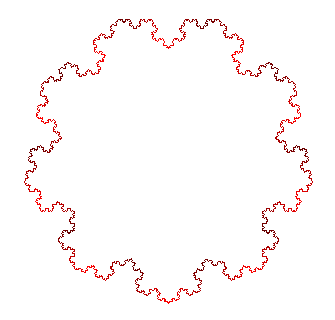

# SharpTurtle

SharpTurtle is a remake of the classic "Turtle graphics" in C#

So far, only basic features are implemented. See "SharpTurtleExample" for a working fractal generator, utilizing all currently-available features. Here is the fractal it will generate:

## TODO:

	- Turtle icon
		- Stamping
		- Destamping
	- Circle function
	- Filling
	- Better threadsafe implementation of TurtleViewer

